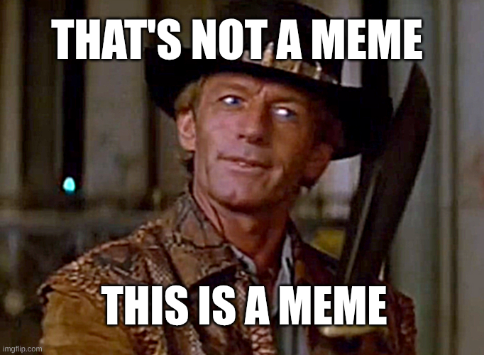

# Challenge 3: Meme Generator 2.0 (FINAL)

## Themes
- Memes
- AI
- Getting judged on a livestream (no pressure)

## The Challenge
Build an AI-powered meme generator that creates new memes. Your generator should produce original, entertaining memes based on user input, trending topics, current events, or your own unique brand of weirdness.

## Requirements
- Generate memes (images, captions, or both)
- Containerized using Chainguard Containers
- Exercise enough good taste that we dont' get embarassed on the livestream. If in doubt, reach out.

## Antirequirements
- We assume you'll probably use AI, but if you want to go in some other direction, go for it
- Memes can be generated out of some input or ex nihilo (out of nothing)
- Can be web app, CLI, whatever.
- Dan Lorenc will be judging you and he's, like, a big deal security guy. Up to you if you want to think about security. 🙃

## Deadline
XXX

This is the final - top 3 teams only. Will be demoed live on stream.
